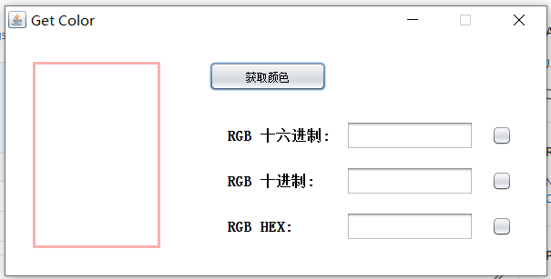
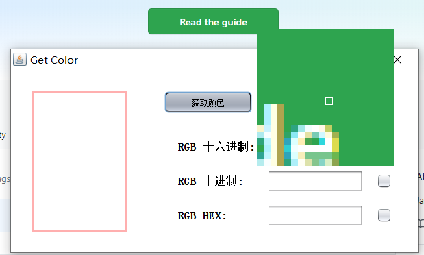
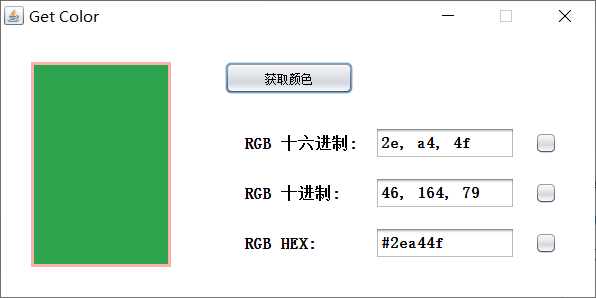
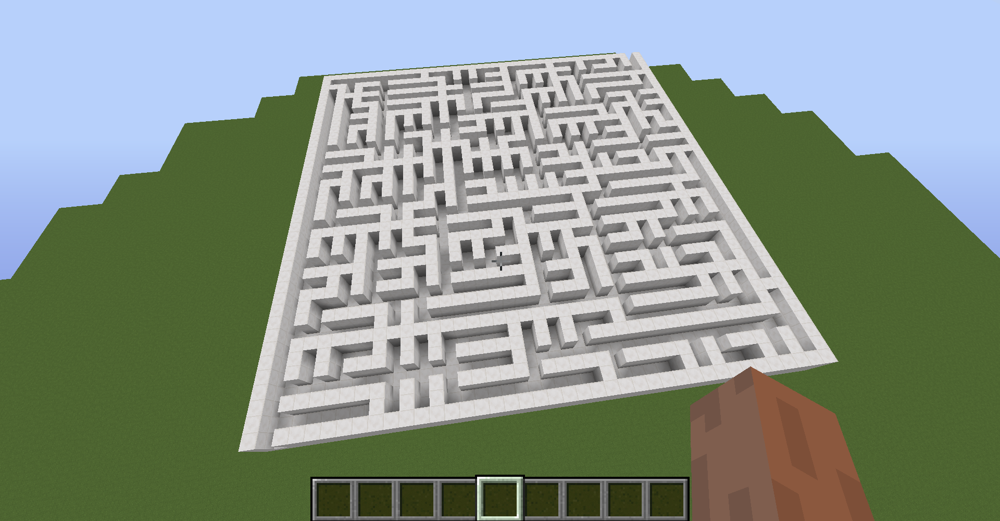
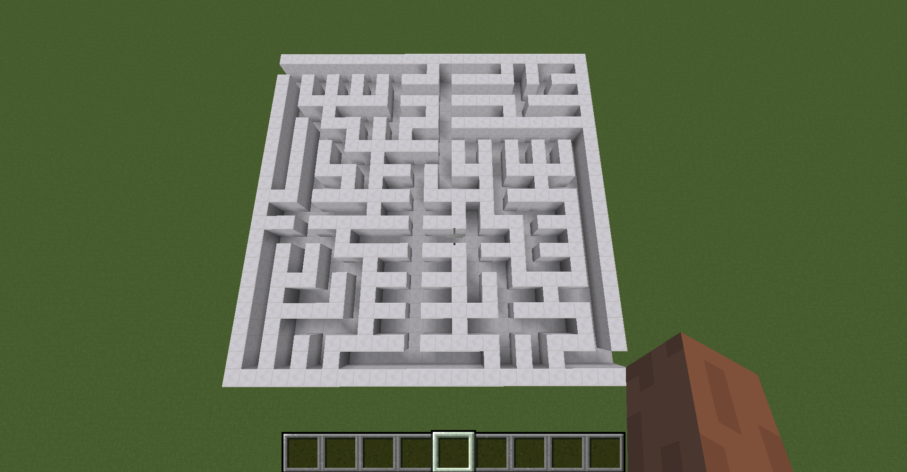

# 颜色提取器 - GetColor

# MC迷宫生成

### 效果

### 使用

- 运行后在根目录下生成migo.mcfunction文件
- 将该文件复制到.minecraft\saves\test\data\functions\migo（test是一个存档的名字，如果没有某一级文件夹就新建）
- 进入游戏，运行指令`/reload`  后运行 `/function migo:migo`

