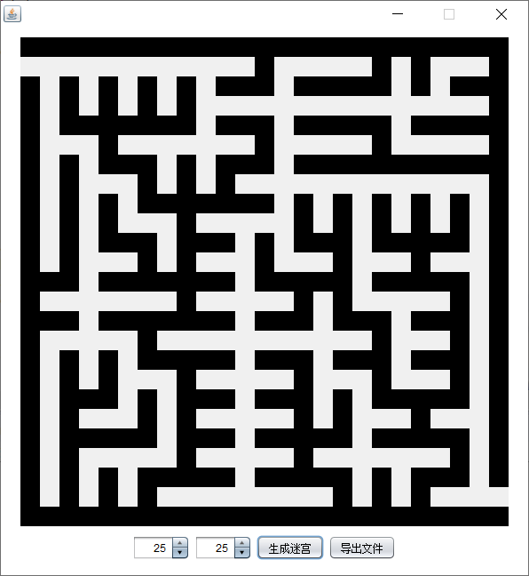
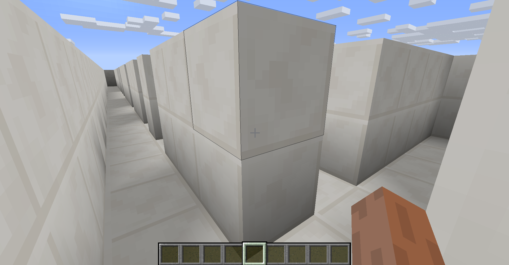
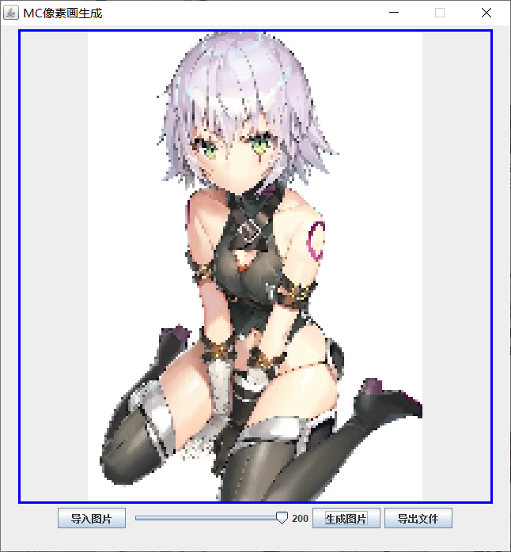
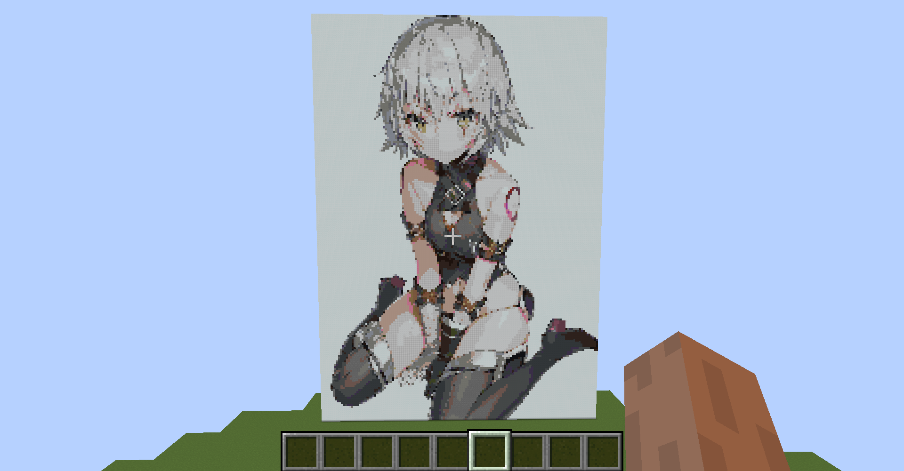

# 颜色提取器 - GetColor

# MC迷宫生成

### 效果

### 使用

- 生成迷宫后导出maze.mcfunction文件
- 将该文件复制到.minecraft\saves\test\data\functions\maze（test是一个存档的名字，如果没有某一级文件夹就新建）
- 进入游戏，运行指令`/reload`  后运行 `/function maze:maze`

# MC像素画生成

### 效果

